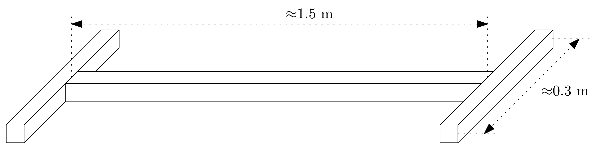
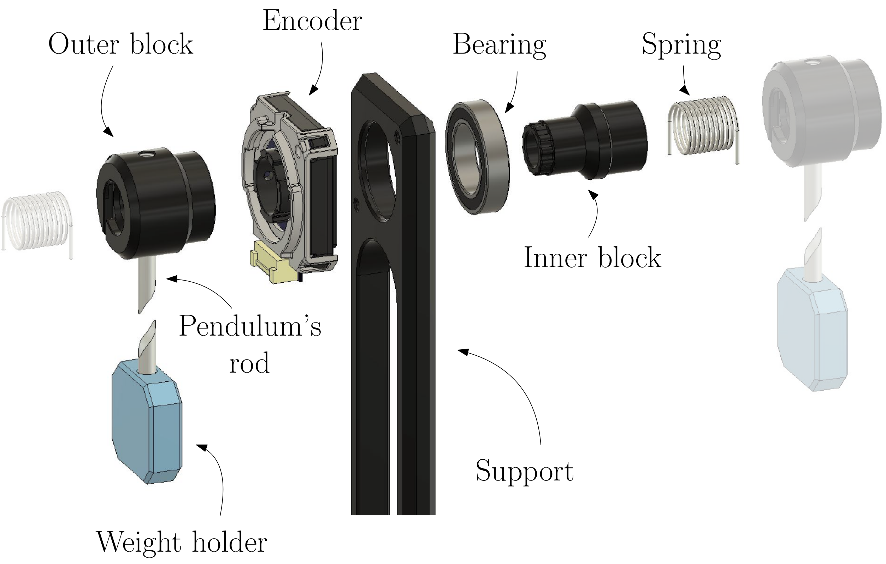
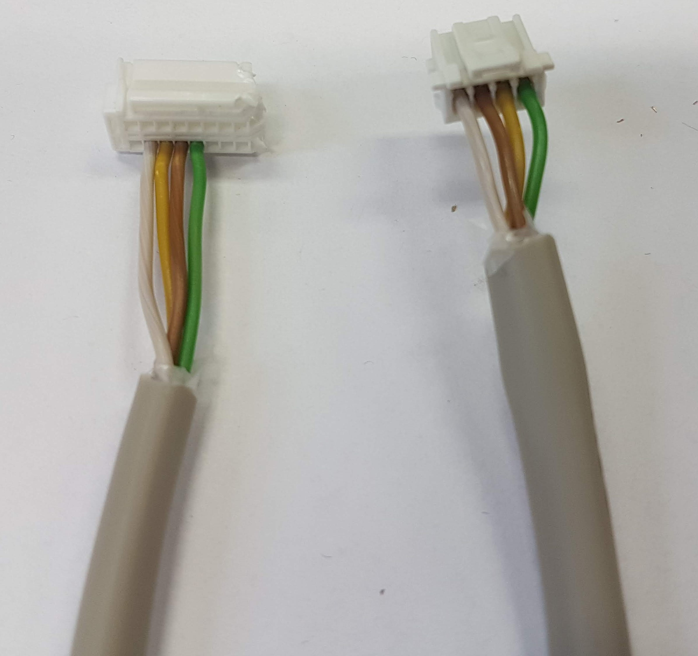

The complete bill of materials needed for the whole model is [here](https://aa4cc.github.io/The-Frenkel-Kontorova-laboratory-model/bill-of-materials).

The assembly guide shows, how to make following things:
1. Frame
2. Pendulum segment
3. Motor segment
4. FPGA shield
5. Miscellaneous

# 1. Frame
The frame is constructed from three aluminum profiles 40x40, 8 mm slot I-TYPE.
The configuration and recommended lengths for 20 pendulums with two motors are depicted in the following figure:

# 2. Pendulum segment
The pendulum segment is designed as a combination of off-the-shelf and 3D-printed components.

## Requirements
- Spring
- Bearing
- Pendulum's Support
- Pendulum's rod
- Rotary encoder
- Pendulum's block
    - Inner block
    - Outer block
- Weight holder

## Instructions
- The configuration of the pendulum segment is here: <https://a360.co/3uP4RIG>.
    
    - Insert the **bearing** into the **support**
    - Insert the **inner block** into the **bearing**
    - Attach the **encoder** to **support** using 2 diagonally placed screws or all 4 screws
    - Place the **outer block** onto the **inner block** and the **encoder**
    - Insert **pendulum's rod** with **weight holder** into the **outer block**
    - Insert the spring into the **outer/inner** block

# Encoder cable
## Requirements

## Instructions
- Get desired length of the **cable**
- On both sides, crimp the conductors and insert them into the connectors.
    - For the **JST ZPDR-18V-S**, use the contact **SZPD-002T-P0.3**
    - See picture below of the desired cable configuration. Note, that because the **JST ZPDR-18V-S** was not available at the time of the assembly, we had to buy **JST ZPDR-20V-S** and cut off a part of the connector.
    - Note, that the order of colors is not the same on both connectors.
  

# Motor segment

## Requirements

