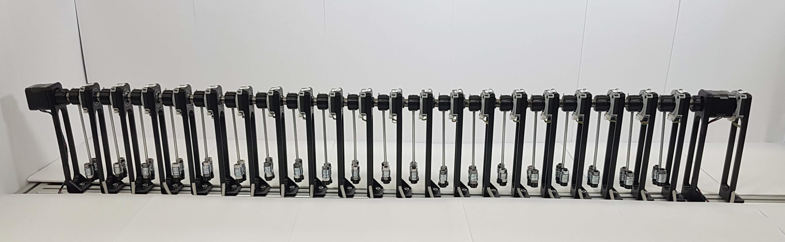

# Introduction
The Frenkel-Kontorova laboratory model is an multi-pendulum platform that we developed as a testbed for control algorithms for this class of dynamical systems, for instance, distributed control or control of flexible structures. 

# Design
You can see the model in the following picture:

Detailed building instructions are available [here](https://aa4cc.github.io/The-Frenkel-Kontorova-laboratory-model/buildingInstructions_HW/).

## Pendulum segment
3D model of one segment of the model is available at:

<https://a360.co/3uP4RIG>

## Motors and drivers
The motors actuating the chain are NEMA17 1.8° stepper motors controlled by Pololu Tic T249 drivers. Information about drivers is available at:

<https://www.pololu.com/product/3138>

## Data acquisition
All relavant information are available at:

<https://github.com/ptrbroz/AA4CC_FK_model_sensors>

