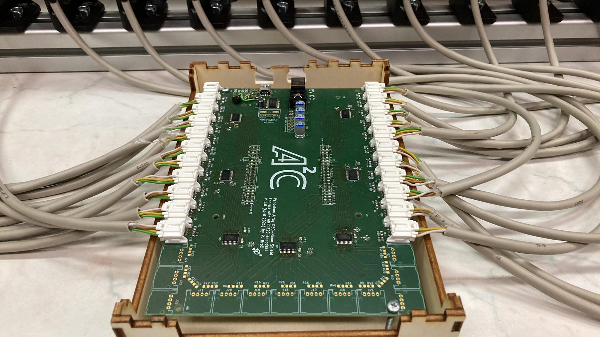

# Introduction
The Frenkel-Kontorova laboratory model is an multi-pendulum platform that we developed as a testbed for control algorithms for this class of dynamical systems, for instance, distributed control or control of flexible structures. 

<!--
## Navigation
- Building instructions are available [here](https://aa4cc.github.io/The-Frenkel-Kontorova-laboratory-model/building-instructions-HW/).
- Bill of materials is [here](https://aa4cc.github.io/The-Frenkel-Kontorova-laboratory-model/building-instructions-HW/).
- Software configuration is available [here](https://aa4cc.github.io/The-Frenkel-Kontorova-laboratory-model/building-instructions-HW/).
-->

# Design
You can see the model in the following picture:

- Building instructions are available [here](https://aa4cc.github.io/The-Frenkel-Kontorova-laboratory-model/building-instructions-HW/).
- Bill of materials is [here](https://aa4cc.github.io/The-Frenkel-Kontorova-laboratory-model/building-instructions-HW/).
- Software configuration is available [here](https://aa4cc.github.io/The-Frenkel-Kontorova-laboratory-model/building-instructions-HW/).

## Pendulum segment
3D model of one segment of the model is available at:
- <https://a360.co/3uP4RIG>

The segment is constructed as a combination of off-the-shelf and 3D-printed components.

## Motors and drivers
The motors actuating the chain are NEMA17 1.8° stepper motors controlled by Pololu Tic T249 drivers. Information about drivers is available at:
- <https://www.pololu.com/product/3138>

## Data acquisition
The angles of the pendulums are measured by rotary encoders AMT132S-V by *CUI*. 
To rapidly process all measurements, we designed a custom-made shield for FPGA board. 
The board is designed for maximum of 35 encoders, allowing read-out with a
frequency up to 500 Hz and a resolution of 4096 pulses per one revolution.

All relevant information are available at:
- <https://github.com/ptrbroz/AA4CC_FK_model_sensors>

